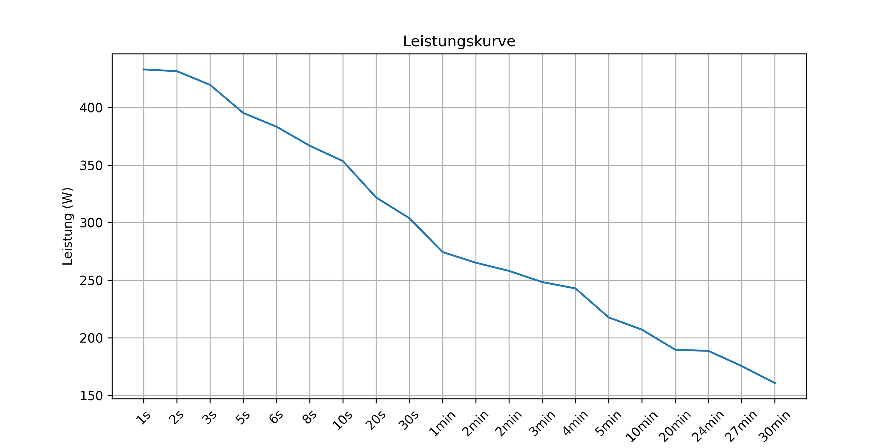

# Leistungskurve_II

# Programminfo:

Das Programm ist die dritte Aufgabe für die Lehrveranstaltung Programmierübung durchgeführt von Auer Lukas und Gleinser Christoph.

# Vorgabe:

Aufgabe ist es die Datei activity.csv einzulesen und basierend auf den Leistungswerte eine Power Curve als Plot auszugeben.

# Installationsanleitung:

Bevor das Programm verwendet werden kann, muss das Repository auf Ihr Gerät geklont ( Befehl: git clone https://github.com/gc0453/Leistungskurve_II.git) und mit PDM installiert werden ( Befehl: pdm install ). Das Programm kann anschließend mit dem folgenden Befehl ausgeführt werden: pdm run main.py 

# Programmbeschreibung:

Das gesamte Programm ist in drei Unterprogramme und in ein Hauptprogramm unterteilt  
 
read_clean_df.py -> Liest die Daten ein und entfernt alle None-Werte bei der Leistung  
power_curve.py -> Erstellt die Werte fuer die Leistungskurve  
make_plot.py -> Erstellt den Plot und die Grafik im Screenshot-Ordner  
main.py -> Führt alle Teilprogramme aus

# Screenshot Plot Power Curve

